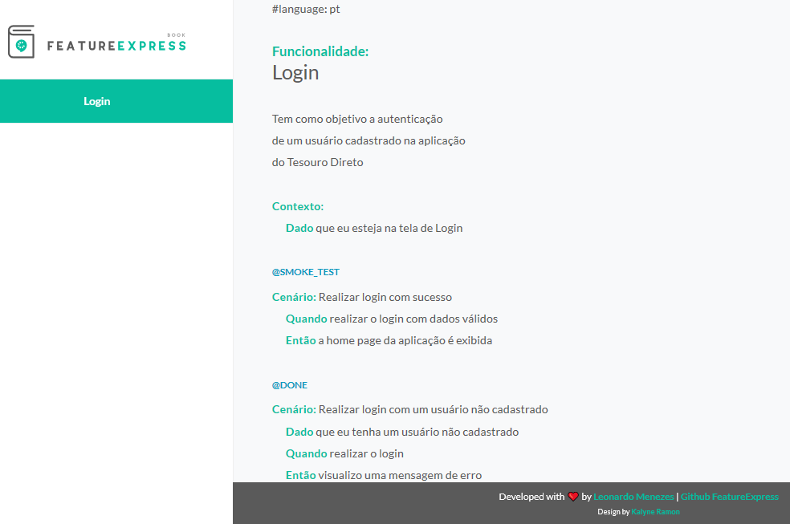

# Onboarding Concrete - QA

## *Objetivo*

    Aplicação utilizada: Tesouro Direto

    Escrita de uma especificação relacionada à funcionalidade Login, a qual possui tags relacionadas às camadas da aplicação
    onde os testes deverão ser executados após suas implementações.

## *Legendas para as tags utilizadas*

    @smoke_test: indica o cenário prioritário para a funcionalidade, o qual deverá ser executado em todos os ambientes disponíveis, 
    inclusive o de produção.

    @~instrumentado: indica quais cenários deverão ser executados na camada de UI utilizando a estratégia instrumentada.

    @~servico: indica quais cenários deverão ser executados na camada de serviço.

    Utiliza-se o "~" antes do nome de uma determinada tag para manter o cenário no arquivo .feature, mas sem que haja a sinalização, pelo Cucumber, da necessidade de sua implementação.

## *Jornada de Usuário*  

## *Algumas ideias abordadas*

    A qualidade de um produto vai além das atividades desempenhadas pelo QA. Ela é resultante do empenho de cada profissional e, por isso, o compartilhamento e colaboração de todo o time na construção e manutenção da especificação são consideradas boas práticas, fazendo com que todos tenham conhecimentos dos cenários pensados e possam adicionar novos, caso seja necessário.

    É importante que a especificação esteja compreensível a todos, sejam pessoas com conhecimentos técnicos ou não, além de ter uma abordagem direta e resumida do que deve ocorrer quando determinados comportamentos forem executados. Se houver a percepção de ambiguidades ou outros feedbacks não positivos, modificações deverão ser feitas.
    Essas preocupações são necessárias porque o objetivo desta documentação é entregar valor a todo o time e ao cliente, além de ser utilizada e complementada durante todo o projeto.
    
    O smoke test, como dito na seção sobre as legendas utilizadas, pode ser executado em qualquer ambiente, inclusive em produção. Por essa razão, antes de atribuir essa categoria a um determinado cenário, é necessária uma análise sobre o seu impacto e/ou custo para o cliente.
    Exemplo disto é realizar testes numa funcionalidade onde será debitada uma quantia em dinheiro duma conta real, por exemplo. O mais indicado, numa situação como esta, seria utilizar tags como @dev e @homolog e, assim, garantiríamos o tesde de um cenário importante em dois ambientes distintos, havendo feedback e zero impactos negativos ao cliente real.

## *Feature-Express*

    Esta ferramenta open source nos permite apresentar um ou mais arquivos .feature de maneira agradável e organizada. Recomendevável utilizá-la quando for necessário apresentar os cenários das features aos stakeholders, havendo foco visual somente no que interessa: a feature.

    Para a sua utilização são necessários os seguintes itens:
    
        1. Instalação do node;
        2. Execução do comando npm install -g feature-express;
        3. Execução do comando feature-express [caminho/para/arquivos/feature/] pt [4444]

    O tutorial de instalação mais detalhado e com outras dicas pode ser encontrado no link abaixo:
<https://medium.com/assertqualityassurance/feature-express-uma-forma-elegante-de-expor-as-features-criadas-para-os-stakeholders-4dc2e46934f7>
